# Proyecto BDII

Sistema de base de datos relacional con aplicación de índices

## Ejecutar el Proyecto

Por defecto usamos Docker para aislar dependencias y evitar problemas de versiones. Ejecute

```bash
make
```

Esto construirá las imágenes y levantará ambos servicios:

- **Backend**: `http://127.0.0.1:8000`
- **Frontend**: `http://localhost:5173`


# Introducción: Indexación

*(completar)*

---

# Funcionamiento: Técnicas utilizadas e índices

Se pretende revisar un poco el funcionamiento de la aplicación y las técnicas implementadas. Se hace una revisión específicamente al **backend** de la aplicación, y su aspecto teórico.

---

## Nociones básicas

Algunos aspectos importantes de entender para comprender el funcionamiento son los siguientes:

### Estructura de archivos

La estructura de los archivos del programa se puede entender como un **árbol n-ario de tres niveles**, donde cada nivel cumple lo siguiente:

- **1er nivel (raíz):** Guarda el directorio, la relación entre el nombre de las tablas y los archivos respectivos. Apuntan a las tablas indexadas.  
- **2do nivel (tablas base):** Guardan el *schema* de los registros, y la relación entre los índices creados y los archivos respectivos. Por defecto, si no se indica un índice sobre la llave primaria, se usa como mínimo un **Heap**.  
- **3er nivel (tablas indexadas):** Guardan en sí los datos físicos. Cada una de estas guarda primeramente el esquema de los datos que están guardando, y luego en sí la data. Dependiendo si son índices agrupados o no agrupados, guardan un esquema diferente.

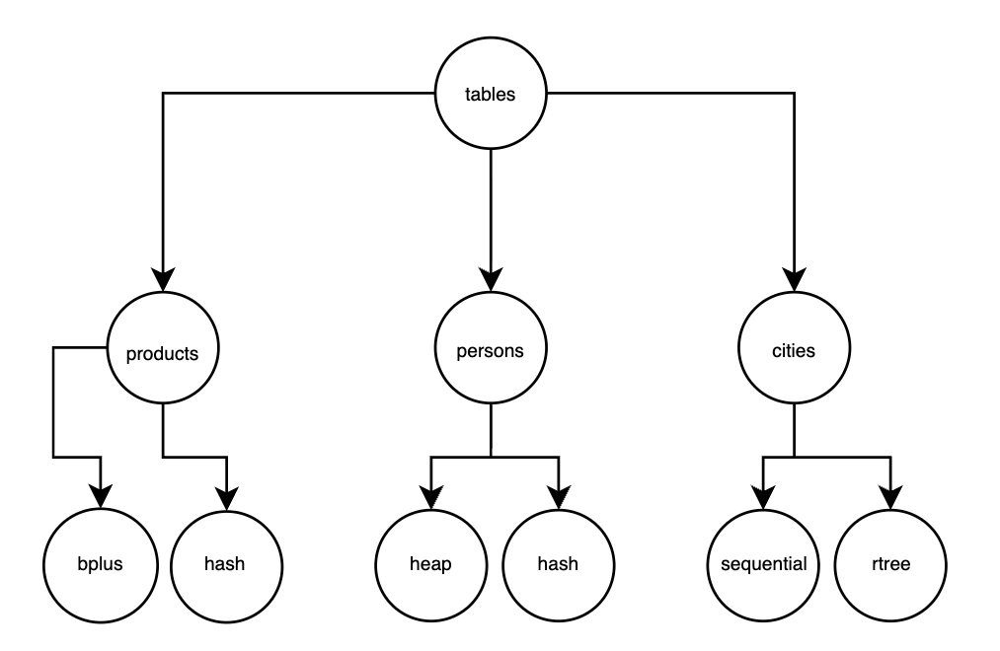

Por ejemplo, si solo hubiéramos creado la tabla:

```sql
CREATE TABLE lugares (
    id INT PRIMARY KEY,
    name VARCHAR(32),
    coords VARCHAR(64),
    INDEX(id) USING sequential,
    INDEX(coords) USING rtree
);
```

La estructura del árbol se vería como:

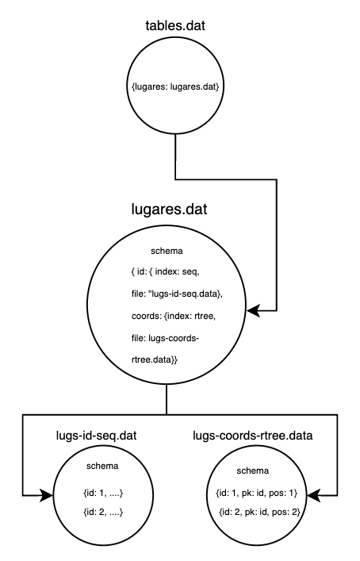

Puedes revisar `backend/catalog/ddl.py` para mayor detalle.

---

### b. Registros: Clase `Record`

Es la clase que maneja y generaliza los registros que se guardan en los archivos. Dado que en los archivos se guarda el esquema de la data, se puede calcular el formato y el tamaño de los registros y con esta clase hacer el *unpack* y *pack*. Note que generaliza cualquier tipo de dato. Ver: `backend/core/record.py`.

---

### c. Manejo de índices

En la aplicación se manejan los siguientes índices:

- **Agrupados:** Heap, Sequential, ISAM y B+  
- **No agrupados:** Extendible Hashing, B+ y RTree

Si no se indica un índice agrupado sobre la llave primaria, por defecto se le asigna **Heap**.  
El índice agrupado guarda la data física. Dependiendo de cuál índice agrupado se use, los índices no agrupados guardarán lo siguiente:

- **Es heap:** Guardan el atributo indexado, su valor y la posición física en el heap.  
- **No es heap:** Guardan el atributo indexado, su valor y la llave primaria.

Ver: `backend/catalog/ddl.py`.

---

## 2. Operaciones implementadas

Se detallan los métodos implementados a nivel de programa. A nivel específico de índices se detallará luego.

### a. Insert

1. Se inserta el registro en el índice agrupado.  
2. Dependiendo si es heap o no, se obtiene la posición física o la llave primaria.  
3. Se inserta en cada índice no agrupado.

---

### b. Remove

- Recibe el atributo por el cual eliminar.  
- Va al índice agrupado y elimina los elementos que cumplan la condición.  
- Elimina también dichos registros en los índices secundarios.

---

### c. Build

- Crea las tablas a partir de un archivo.  
- En ISAM, construye el índice, inserta los elementos y luego los inserta en los índices no agrupados.  
- Para el resto de índices agrupados, reutiliza el método `insert` por cada registro.

---

### d. Searchs

Métodos de búsqueda implementados:

- **Puntual search:** Soportado por todos los índices.  
- **Range search:** No soportado por el hash.  
- **RTree range search:** Exclusivo del RTree.  
- **K nearest neighbors:** Exclusivo del RTree.

Lógica general:

- Si el atributo está indexado y no es llave primaria → buscar primero en índice no agrupado, luego en el agrupado.  
- Si es llave primaria → buscar directamente en el índice agrupado.  
- Si no está indexado → búsqueda secuencial (`same_key = false`).

---

### e. Creación de índices

1. **Índice no agrupado:**  
   - Se extrae toda la data física del índice primario.  
   - Se obtiene la llave o posición.  
   - Se insertan los registros en el nuevo índice.

2. **Índice sobre la llave primaria (actual es heap):**  
   - Se elimina la tabla.  
   - Se vuelve a crear para que los índices no agrupados guarden la llave primaria en lugar de la posición física.

---

### f. Eliminación de índices

- **No agrupado:** Se elimina la tabla y su registro en los índices.  
- **Agrupado:** Se elimina la tabla y se vuelve a crear para que los índices secundarios guarden posición física.

Ver: `backend/storage/file.py` y `backend/catalog/ddl.py`.

---

## 3. Índices

A continuación se analiza la implementación de cada índice y su complejidad en accesos a memoria secundaria. Para las búsquedas y eliminación, se asume que se hacen con el atributo indexado.

---

### a. Heap

El índice **Heap** es agrupado y guarda los registros secuencialmente al final del archivo. Permite que los índices no agrupados guarden la **posición física** de los registros. No se reconstruye ni cambia.

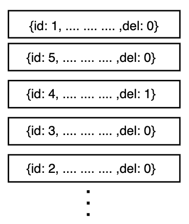

Ver: `backend/storage/indexes/heap.py`.

#### Insert
- Revisa que no haya llaves primarias repetidas.  
- Itera todo el archivo y escribe al final.  
- **Complejidad:** O(n).

#### Search
- Itera todo el archivo.  
- Retorna los registros que cumplan la condición y no estén eliminados.  
- **Complejidad:** O(n).

#### Range Search
- Igual que Search, recorriendo secuencialmente.  
- **Complejidad:** O(n).

#### Remove
- Itera todo el archivo y marca los elementos como eliminados.  
- **Complejidad:** O(n).

### Tabla resumen

| Operación      | Explicación                                                                                          | Caso promedio | Peor caso |
|---------------|-------------------------------------------------------------------------------------------------------|---------------|-----------|
| **Insert**    | Inserta el registro al final del archivo                                                              | O(n)          | O(n)      |
| **Search**    | Itera por todo el archivo y verifica la condición                                                     | O(n)          | O(n)      |
| **Range Search** | Itera por todo el archivo y verifica la condición                                                  | O(n)          | O(n)      |
| **Remove**    | Itera por todo el archivo y marca como eliminado los registros que cumplan con la condición           | O(n)          | O(n)      |

### b. Sequential

Este índice, agrupado, guarda la data secuencialmente ordenada en un primer espacio, y luego tiene un espacio adicional para los registros adicionales. Tomemos que la cantidad de registros en el espacio ordenado es **n**, y en el espacio adicional es **k = log(n)**, ya que si excede este tamaño el sequential se reconstruye. Sigue la estructura de la imagen. Ver: `backend/storage/indexes/sequential.py`.

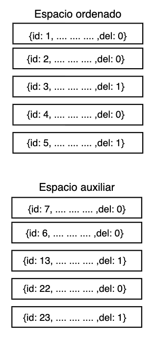

#### Insert

Se debe revisar el archivo para validar repetidos. Primero se busca en el espacio ordenado con **búsqueda binaria** (O(log n)), y luego secuencialmente en el espacio adicional (O(k)). Si no se repite, se inserta al final. En caso el espacio adicional exceda el valor de k, el archivo se reconstruye (O(n)). Por tanto la complejidad es **O(n)**.

#### Search

Dado que la búsqueda es puntual y se indexa por la llave primaria, no hay repetidos. Se busca en el espacio ordenado con búsqueda binaria (O(log n)), y luego en el espacio adicional secuencialmente (O(k)). Por tanto, la complejidad es **O(log n)**.

#### Range Search

Como muchos registros pueden cumplir la condición, se busca secuencialmente en el espacio ordenado (O(n)), y luego en el espacio adicional (O(k)). La complejidad es **O(n)**.

#### Remove

Se remueve lógicamente el registro indicándolo como eliminado. Pero primero se debe buscarlo, así que tiene la misma complejidad que el search: **O(log n)**.

#### Tabla resumen

| Operación        | Explicación                                                                                       | Caso promedio | Peor caso |
|------------------|---------------------------------------------------------------------------------------------------|---------------|-----------|
| **Insert**       | Inserta al final del espacio ordenado. Si este excede el tamaño, se reconstruye el archivo.       | O(log n)      | O(n)      |
| **Search**       | Búsqueda binaria en el espacio ordenado y secuencial en el adicional.                             | O(log n)      | O(log n)  |
| **Range Search** | Búsqueda secuencial en el espacio ordenado y adicional.                                           | O(n)          | O(n)      |
| **Remove**       | Búsqueda binaria en el espacio ordenado y secuencial en el adicional. Se marca como eliminado.    | O(log n)      | O(log n)  |

---

### c. ISAM

Este índice, agrupado, guarda la data en páginas. En la implementación, este examen es de **grado 2**, es decir, tiene dos niveles de índices antes de llegar a las páginas, y estas en caso de no poder hacer *split* se encuentran encadenadas. Para el análisis, se asume que las operaciones se hacen con el atributo indexado.

Definiciones:

- **n**: número de elementos  
- **M**: factor de índice (máx. índices por página de índices)  
- **K**: factor de página (máx. elementos por página de datos)

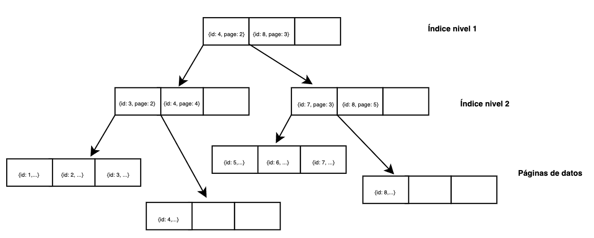

Ver: `backend/storage/indexes/isam.py`.

#### Build

- Se ordenan los elementos según el atributo.  
- Se toma la mediana para dividir los datos.  
- En la raíz se coloca la mediana y el máximo valor.  
- En el segundo nivel, cada página de índice contiene su mediana y máximo.  
- Se direccionan los elementos a sus respectivas páginas de datos.  
- Si se llena alguna página → *split*.  
- Si se llena el segundo nivel de índices → *split*.  
- Si no es posible, se encadenan páginas.

Como el ordenamiento se hace en RAM, los accesos a memoria secundaria provienen de escribir páginas de datos e índices. Complejidad: **O(n / K)** páginas de datos + **O(n / M)** páginas de índice ≈ **O(n)** accesos.

#### Insert

- Se leen: raíz → página de índice → página de datos.  
- Si la página de datos se llena → *split*.  
- Si el índice se llena → *split*.  
- Si no es posible, se encadenan páginas.  
- Si existen páginas encadenadas previas, pueden recorrerse secuencialmente.

Complejidad:  
2 accesos índice + 1 acceso datos = **O(1)** accesos a disco.

#### Search

- Se leen raíz → índice → página de datos.  
- Si no se encuentra y hay encadenamiento, se recorren páginas secuencialmente.

Complejidad:  
- Sin encadenamiento: **O(1)**.  
- Peor caso: **O(1 + t)** (t = páginas encadenadas).

#### Range Search

- Se accede a raíz → índice → primera página de datos.  
- Luego se recorren secuencialmente las páginas que cubren el rango.

Complejidad: **O(1 + t)**.

#### Remove

- Primero se busca el elemento (como en Search).  
- Luego se elimina.  
- Si hay encadenamiento, puede requerirse compactar o mover registros.

Complejidad:  
**O(1)** para encontrar + **O(1)** para modificar = **O(1)** amortizado. En caso de compactar entre t páginas encadenadas → **O(t)**.

#### Tabla resumen

| Operación        | Explicación breve                                                                                                    | Caso promedio       | Peor caso    |
|------------------|-----------------------------------------------------------------------------------------------------------------------|---------------------|-------------|
| **Build**        | Se ordenan los datos en RAM y luego se escriben páginas de datos e índices.                                          | O(n / K) ≈ O(n)     | O(n / K) ≈ O(n) |
| **Insert**       | Acceso a raíz → índice → página de datos. Si se llena, *split* o encadenamiento.                                     | O(1)               | O(1 + t)    |
| **Search**       | Raíz → índice → página de datos. Si hay encadenamiento, se recorren páginas siguientes.                              | O(1)               | O(1 + t)    |
| **Range Search** | Buscar página inicial y recorrer páginas siguientes hasta finalizar el rango.                                        | O(t)               | O(t)        |
| **Remove**       | Buscar (como Search) y eliminar. Si hay encadenamiento, compactar pasando registros de páginas siguientes si aplica. | O(1)               | O(1 + t)    |

---

### d. Extendible Hashing

Este índice dinámico utiliza un **directorio de hash** en memoria que crece de forma **controlada** conforme se insertan nuevos elementos. Su principal ventaja es que evita reorganizar toda la estructura cuando crece, gracias a **splits locales** y **cadenas de desbordamiento con longitud acotada**.

Definiciones:

- **n**: número de elementos  
- **B**: capacidad de registros por bucket  
- **d**: profundidad global (bits usados del hash)  
- **c**: longitud de la cadena de overflow  
- `BUCKET_SIZE = 5`, `INITIAL_MAX_CHAIN = 2`, `MAX_GLOBAL_DEPTH = 20`

Ver: `backend/storage/indexes/hash.py`.

---

#### Build

- Se inicializa el directorio con profundidad global 1.  
- Se crean 2 buckets iniciales vacíos.  
- Se insertan todos los registros calculando su hash y dirigiéndolos al bucket correspondiente.  
- Cuando un bucket se llena:  
  - Si la división es productiva, se realiza un **split**, actualizando el directorio y redistribuyendo registros.  
  - Si no, se crea un bucket encadenado (overflow).  
- Si la profundidad local = global, se **duplica el directorio** antes de dividir.

Como no hay un ordenamiento previo, el costo está dominado por el número de inserciones y splits necesarios.

Complejidad aproximada:  
- Inserciones directas: **O(n)**  
- Splits: cada split redistribuye ≤ B registros → **O(n)** total amortizado.

---

#### Insert

- Se calcula el hash y se toma **d bits** para acceder al bucket en el directorio.  
- Se lee el bucket:  
  - Si hay espacio → insertar directamente.  
  - Si está lleno → recorrer cadena de overflow si no excede la longitud máxima.  
  - Si se excede y la división es productiva → **split del bucket** y reinserción.  
  - Si no es productiva → se encadena un nuevo bucket.  
- Si `local_depth == global_depth` → duplicar directorio antes del split.

Complejidad:  
- Inserción directa: **O(1)**  
- Encadenamiento: **O(1)** (longitud acotada)  
- Split: **O(n)** en el peor caso, pero **amortizado O(1)**.

---

#### Search

- Se calcula el hash → se indexa en el directorio.  
- Se accede al bucket y se busca linealmente.  
- Si no se encuentra y hay cadena de overflow, se recorren secuencialmente los buckets encadenados.

Complejidad:  
- Caso promedio: **O(1)** (por tamaño fijo de bucket y cadenas cortas).  
- Peor caso: **O(1 + c)**, siendo c la longitud máxima de cadena.

---

#### Range Search

El hashing extensible **no soporta búsquedas por rango de manera eficiente**, ya que los buckets no siguen un orden lógico de claves. Para realizar una búsqueda por rango, sería necesario recorrer **todos los buckets**, lo que implica **O(n)**.

---

#### Remove

- Se calcula el hash → se ubica el bucket → se busca el registro.  
- Si se encuentra, se elimina directamente y se actualiza la página en disco.  
- Si hay cadenas, puede implicar recorrerlas secuencialmente.  
- Opcionalmente se puede compactar buckets de overflow si quedan vacíos.

Complejidad:  
- Búsqueda: **O(1 + c)**  
- Eliminación: **O(1)**  
- Compactación: **O(c)** si aplica.

---

#### Tabla resumen

| Operación        | Explicación breve                                                                                                            | Caso promedio | Peor caso |
|------------------|-------------------------------------------------------------------------------------------------------------------------------|---------------|-----------|
| **Build**        | Inicializa directorio y buckets, inserta registros uno a uno, haciendo splits locales y chaining cuando es necesario.         | O(n)         | O(n)     |
| **Insert**       | Accede al bucket vía hash, inserta si hay espacio; si no, hace chaining o split. Directorio se duplica si es necesario.       | O(1)\*      | O(n)     |
| **Search**       | Se calcula hash y se accede directamente al bucket; si hay cadena, se recorre secuencialmente.                                | O(1)        | O(1 + c) |
| **Range Search** | No está soportado eficientemente. Requiere recorrer todos los buckets.                                                        | O(n)        | O(n)     |
| **Remove**       | Se calcula hash, se accede al bucket y se elimina. Si hay cadenas, se recorren y compactan si aplica.                         | O(1)        | O(1 + c) |

---

### R-Tree

El **R-Tree** es un índice espacial jerárquico que organiza datos multidimensionales mediante **MBRs** (Minimum Bounding Rectangles). Cada nodo almacena M entradas como máximo, y los nodos internos representan rectángulos que engloban a sus hijos.  Su estructura permite realizar búsquedas espaciales eficientes (punto, rango, kNN) evitando recorrer todo el conjunto de datos.

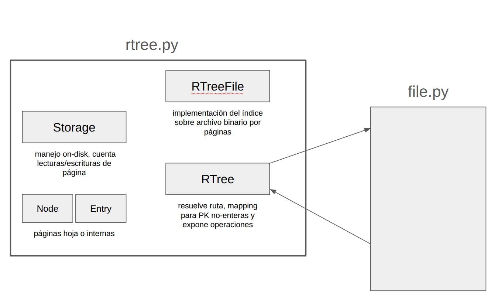

Ver: `backend/storage/indexes/rtree.py`.

#### Insert
- Se selecciona la hoja cuya expansión de MBR sea mínima.  
- Si el nodo se llena, se realiza un **split cuadrático** y se actualizan los MBR hacia la raíz.  
- **Complejidad promedio:** O(logₘ n)  
- **Peor caso:** O(n/M) (si ocurren múltiples splits).

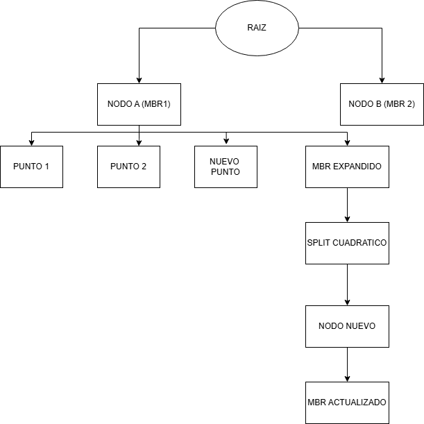

#### Search
- Recorre solo los nodos cuyos MBR contienen el punto consultado.  
- **Complejidad promedio:** O(logₘ n)  
- **Peor caso:** O(n/M) (si hay solapamiento y se deben explorar muchas ramas).

#### Range Search
- Explora los nodos cuyos MBR intersectan el área consultada y filtra registros en hojas.  
- **Complejidad promedio:** O(logₘ n + k)  
- **Peor caso:** O(n/M + k) (si la región cubre casi todos los nodos o hay solapamiento extremo).

#### Remove
- Localiza la hoja y elimina el registro.  
- Si el nodo queda por debajo del mínimo, se redistribuye o reinserta contenido.  
- **Complejidad promedio:** O(logₘ n)  
- **Peor caso:** O(n/M) (si hay reinserciones masivas o recorridos múltiples).

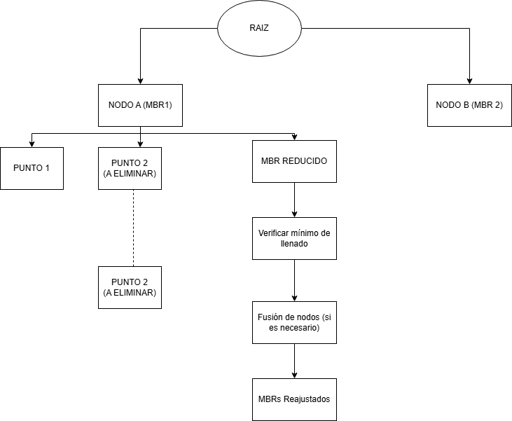

#### KNN
- Utiliza una **cola de prioridad** para explorar nodos ordenados por distancia mínima al punto.  
- **Complejidad promedio:** O(logₘ n + k log k)  
- **Peor caso:** O(n/M + k log k) (si no se puede podar ninguna rama).

---

### Tabla resumen

| Operación         | Explicación breve                                                                                          | Caso promedio               | Peor caso                    |
|-------------------|-------------------------------------------------------------------------------------------------------------|-----------------------------|------------------------------|
| **Insert**        | Inserta un nuevo registro, ajusta MBRs y divide nodos si hay overflow.                                     | O(logₘ n)                   | O(n/M)                       |
| **Search**        | Busca un punto exacto recorriendo solo MBRs relevantes.                                                    | O(logₘ n)                   | O(n/M)                       |
| **Range Search**  | Busca registros dentro de un área, explorando solo nodos intersectados.                                    | O(logₘ n + k)              | O(n/M + k)                   |
| **Remove**        | Elimina el registro y reorganiza nodos si es necesario.                                                   | O(logₘ n)                   | O(n/M)                       |
| **KNN**           | Busca los k vecinos más cercanos usando poda espacial y cola de prioridad.                                 | O(logₘ n + k log k)        | O(n/M + k log k)            |

---

### e. B+

Este índice, agrupado y no agrupado, se organiza en páginas de datos. Es similar al ISAM, pero a diferencia de este, **no necesita construirse previamente**, sino que es **dinámico** y crece conforme se insertan registros. Para el análisis, se asume que las operaciones se realizan sobre el atributo indexado.

Sea:

- **n** = número de registros  
- **K** = orden del nodo (máx. punteros por nodo)

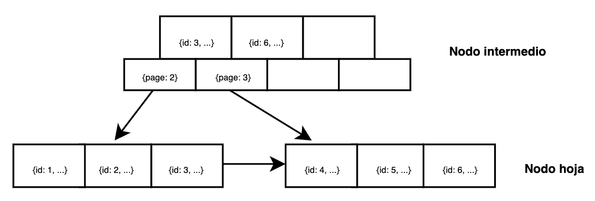

Ver: `backend/storage/indexes/isam.py`.

#### Insert

- Se recorre el árbol desde la raíz hasta la hoja correspondiente.  
- Si la hoja está llena → *split*.  
- El *split* puede propagarse hacia niveles superiores hasta la raíz.  
- Cada *split* implica lectura y escritura de páginas.

Complejidad: **O(logₖ n)**.

#### Search

- Se desciende desde la raíz hasta la hoja que contiene la clave.  
- Cada nivel implica una lectura en memoria secundaria.

Complejidad: **O(logₖ n)**.

#### Range Search

- Se localiza el nodo hoja que contiene la clave inicial.  
- Luego se recorren secuencialmente las páginas hoja siguientes hasta cubrir el rango.

Complejidad: **O(logₖ n + t)** (t = páginas de datos leídas).

#### Remove

- Se busca la clave y se elimina.  
- Complejidad: **O(logₖ n)**.

#### Tabla resumen

| Operación        | Explicación                                                                                                  | Caso promedio    | Peor caso        |
|------------------|--------------------------------------------------------------------------------------------------------------|------------------|------------------|
| **Insert**       | Busca la hoja correspondiente y agrega el dato; si se llena, divide la página y actualiza índices.          | O(logₖ n)       | O(logₖ n)       |
| **Search**       | Recorre desde la raíz hasta la hoja para encontrar el valor exacto.                                        | O(logₖ n)       | O(logₖ n)       |
| **Range Search** | Encuentra el primer valor del rango y luego recorre secuencialmente las páginas hoja siguientes.          | O(logₖ n + t)  | O(logₖ n + t)  |
| **Remove**       | Ubica el dato, lo elimina.                                                                                | O(logₖ n)       | O(logₖ n)       |

---

### f. RTree

*(completar)*

Ver: `backend/storage/indexes/rtree.py`.

## 4. Análisis comparativo

Habiendo visto cada técnica de indexación, podemos resumir las operaciones en la siguiente tabla. Estamos tomando en cuenta el **peor caso** para cada operación.

| Índice       | Insert     | Search      | Range Search        | Remove       | KNN                       |
|-------------|-----------|-------------|---------------------|-------------|---------------------------|
| **Heap**        | O(n)      | O(n)        | O(n)               | O(n)        | -                         |
| **Sequential**  | O(n)      | O(log n)   | O(n)               | O(n)        | -                         |
| **ISAM**        | O(n / K) | O(1 + t)   | O(1 + t)           | O(1 + t)   | -                         |
| **Hash**        | O(n)      | O(c + B)   | -                   | O(c + B)   | -                         |
| **B+**          | O(logₖ n) | O(logₖ n) | O(logₖ n + t)     | O(logₖ n) | -                         |
| **RTree**       | O(n / M) | O(n / M)   | O(n / M + k)      | O(n / M)   | O(n / M + k log k)       |

---

### Insights

### Heap y Sequential File
Son estructuras sencillas pero poco eficientes en disco. Para operaciones como búsqueda, inserción o eliminación, suelen requerir recorrer muchas páginas (**O(n)**), por lo que no son adecuadas cuando se busca minimizar lecturas y escrituras.

### ISAM y Hashing
Optimizan muy bien búsquedas puntuales con pocos accesos a página (**O(1 + t)** o **O(c + B)**), pero no soportan bien inserciones dinámicas o búsquedas por rango. Son ideales cuando los datos son estáticos o crecen poco.

### B+ Tree
Es el índice más balanceado y eficiente para datos en disco:

- Mantiene accesos logarítmicos (**O(logₖ n)**) en insert, search y delete.  
- Es excelente para range search, ya que las hojas están encadenadas secuencialmente (**O(logₖ n + t)**).  
- Por eso es el índice estándar en bases de datos.

### R-Tree
Diseñado para datos espaciales (2D, 3D), no para datos lineales.

- En promedio opera en **O(logₘ n)**.  
- En el peor caso, cuando los MBR se solapan mucho, puede requerir leer casi todas las páginas hoja (≈ O(n / M)).  
- Es el único que permite *range spatial* y *kNN* eficientemente sin recorrer todos los registros.

---

### Análisis

- Si se buscan **mínimos accesos a disco con datos lineales**, el **B+ Tree** es la mejor opción.  
- Si los datos son **estáticos o con pocas inserciones**, el **ISAM** ofrece buenos tiempos de búsqueda (**O(1 + t)**), aunque no se reequilibra dinámicamente.  
- Para **datos espaciales o geográficos**, el **R-Tree** es necesario, aunque puede acercarse al recorrido total del archivo en el peor caso.  
- Heap, Sequential y Hash solo son adecuados para usos específicos o cuando el acceso a disco no es crítico.

---

## 5. Parser SQL

*(completar)*

---

# Resultados: Mediciones y experimentos

*(completar)*

---

# Presentación: Uso y pruebas

Se revisará el frontend de la aplicación. La interfaz se ve como en la siguiente imagen:


En la parte izquierda se muestran las tablas creadas con sus atributos e índices. Se deja un espacio para escribir secuencias SQL y un botón para ejecutarlas. Debajo se muestra la data, y cada vez que se ejecuta una operación se muestra la información de escritura y lectura, además del planificador, como se ve en la siguiente imagen:

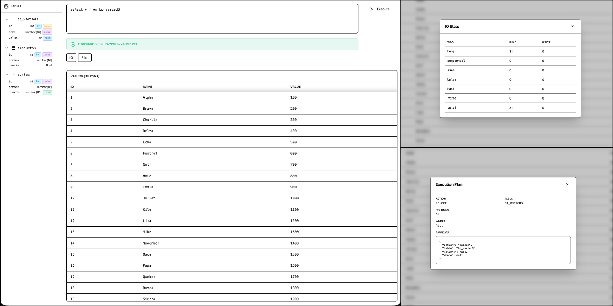

---

## Definición de estructuras

```sql
CREATE TABLE <tabla> (
  <col> <tipo> [PRIMARY KEY [USING <método>]]
              [INDEX USING <método>],
  ...
  [ , INDEX(<col>) USING <método> ]
);

CREATE TABLE <tabla> FROM FILE '<path>'
  [USING INDEX <método>(<col>)];

CREATE INDEX [IF NOT EXISTS] <idx> ON <tabla> (<col>) [USING <método>];

DROP INDEX [IF EXISTS] <idx> [ON <tabla>];
-- (también soportado: DROP INDEX [IF EXISTS] ON <tabla> (<col>))

DROP TABLE [IF EXISTS] <tabla>;
```

---

## Inserción de datos

```sql
INSERT INTO <tabla> [(col1, col2, ...)]
  VALUES (<v1, v2, ...>)[, (<v1, v2, ...>), ...];

INSERT INTO <tabla> [(col1, col2, ...)]
  FROM FILE '<path>';
```

---

## Condiciones en WHERE

```sql
-- WHERE (predicados)
--  <geo_col> IN (POINT(x, y), r)
--  <geo_col> KNN (POINT(x, y), k)
--  <col> BETWEEN <a> AND <b>
--  <col> = <valor>
```

---

## Casos de uso

### Caso 1

```sql
CREATE TABLE productos (
  id INT PRIMARY KEY USING bplus,
  nombre VARCHAR(16),
  precio FLOAT
);

INSERT INTO productos (id, nombre, precio)
  VALUES (1, 'Lapiz', 0.5),
         (2, 'Borrador', 0.3),
         (3, 'Cuaderno', 2.5);

SELECT * FROM productos
  WHERE precio = 0.5;
```

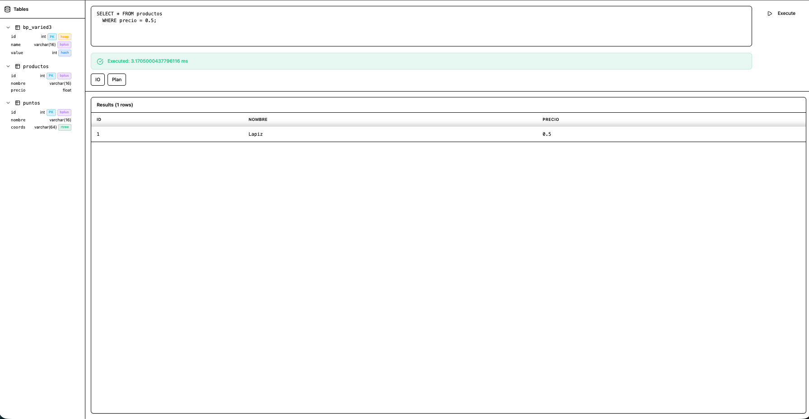

---

### Caso 2

```sql
CREATE TABLE puntos (
  id INT PRIMARY KEY USING bplus,
  nombre VARCHAR(16),
  coords VARCHAR(64) INDEX USING rtree
);

INSERT INTO puntos (id, nombre, coords)
  VALUES (1, 'A', '[0, 0]'),
         (2, 'B', '[10, 10]'),
         (3, 'C', '[5, 5]'),
         (4, 'D', '[2, 1]');

SELECT * FROM puntos
  WHERE coords IN (POINT(0, 0), 5);
```

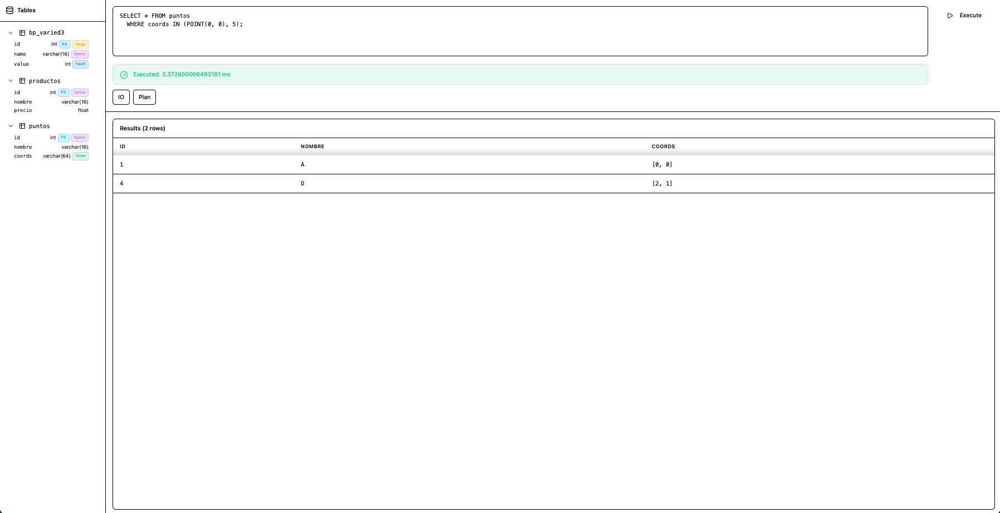

---

## Videos

- **Video 1:**  
- **Video 2:**  

---

# Video: Explicación y detalles

Se anexa un video con una explicación integral de la aplicación, su funcionamiento e índices.
