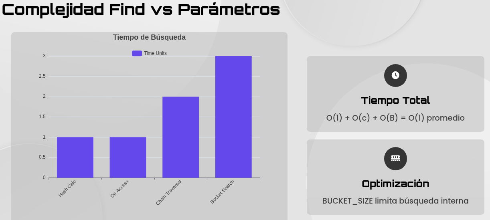

# Análisis de la Implementación de Hashing Extensible

---

## 1.0 Introducción al Sistema de Hashing Extensible

Éste índice está diseñado para la gestión de archivos. Su importancia radica en su capacidad para manejar de manera eficiente grandes volúmenes de datos que requieren inserciones y búsquedas dinámicas. El hashing extensible evita costosas reorganizaciones de todo el archivo a medida que los datos crecen.

Los objetivos de este informe son:

* Detallar la estructura física del archivo en disco, desde la cabecera hasta las páginas de datos.
* Analizar los componentes lógicos que se gestionan en memoria, como el directorio de hash y los buckets.
* Desglosar la lógica de las operaciones fundamentales (inserción, búsqueda y eliminación) y los mecanismos de desbordamiento y división de páginas que garantizan la escalabilidad del sistema.

## 2.0 Componentes Fundamentales

Se implementan dos clases principales: `ExtendibleHashingFile` y `Bucket`. La primera clase actúa como el orquestador, mientras que la segunda como la unidad de almacenamiento de datos.

La clase `ExtendibleHashingFile` es el orquestador principal del sistema. Es responsable de gestionar el directorio de hash, una estructura en memoria que mapea los valores de hash a punteros de página en el archivo. Además, mantiene el estado global del archivo, incluyendo la profundidad global (`global_depth`), que determina el tamaño del directorio, y el índice de la próxima página disponible (`next_page_idx`). Esta clase coordina todas las operaciones de lectura y escritura en el archivo físico en disco, actuando como la interfaz principal para interactuar con los datos.

Por otro lado, la clase `Bucket` representa una página de datos en el archivo. Cada bucket está diseñado para contener un número fijo de registros (`BUCKET_SIZE`). Posee dos atributos clave para la lógica del hashing extensible: su profundidad local (`local_depth`), que indica cuántos bits del hash son significativos para ese bucket en particular, y un puntero a una página de desbordamiento (`overflow_page`), que permite encadenar buckets para manejar colisiones de hash.

En esta tabla realizamos la configuración del sistema y se define mediante un conjunto de constantes que dictan su comportamiento y sus límites teóricos.

| Constante | Valor (del código) | Descripción                                                                                                                                                                                                                                                                                                                                                                                                                                                                                                                                                                                                                                                                                       |
| :--- | :--- |:--------------------------------------------------------------------------------------------------------------------------------------------------------------------------------------------------------------------------------------------------------------------------------------------------------------------------------------------------------------------------------------------------------------------------------------------------------------------------------------------------------------------------------------------------------------------------------------------------------------------------------------------------------------------------------------------------|
| `BUCKET_SIZE` | 5 | Capacidad máxima de registros que puede contener un único bucket (no tiene que ser ni pequeño ni grande).                                                                                                                                                                                                                                                                                                                                                                                                                                                                                                                                                                                         |
| `INITIAL_MAX_CHAIN` | 2 (base) | Establece un valor base para un cálculo dinámico de la longitud máxima de la cadena de desbordamiento, determinada por el método `_max_chain_length()`, que retorna `INITIAL_MAX_CHAIN + self.global_depth`. Esta estrategia de "encadenamiento limitado" es una optimización de rendimiento crucial: actúa como una heurística para diferir la costosa operación de división (`_split`), balanceando el costo de búsquedas lineales en cadenas cortas contra el costo de una reorganización a nivel de archivo. A medida que el directorio crece, el sistema se vuelve más tolerante a cadenas largas, ponderando el creciente costo de una división contra el de escanear un eslabón adicional. |
| `MAX_GLOBAL_DEPTH` | 20 | Impone un límite superior al tamaño del directorio, que no puede exceder $2^{20}$ entradas.                                                                                                                                                                                                                                                                                                                                                                                                                                                                                                                                                                                                       |

Con una comprensión clara de estos componentes fundamentales, podemos ahora examinar cómo se organizan y persisten en la estructura física del archivo en disco.

## 3.0 Estructura del Archivo en Disco

La persistencia de los datos y la capacidad de recuperar el estado del sistema entre ejecuciones dependen de una estructura de archivo bien definida. El layout binario del archivo gestionado por `ExtendibleHashingFile` está organizado secuencialmente para garantizar un acceso eficiente a sus diferentes secciones. La disposición es la siguiente:

1.  **Tamaño del Esquema JSON:** Un entero de 4 bytes sin signo ('I') al inicio del archivo que especifica la longitud en bytes de la siguiente sección.
2.  **Esquema JSON:** Una cadena de caracteres en formato JSON que define la estructura de los registros almacenados. Su longitud es variable, determinada por el valor anterior.
3.  **Cabecera del Directorio:** Un bloque fijo de 8 bytes que almacena dos enteros ('ii'): `global_depth` y `next_page_idx`. Estos dos valores son suficientes para reconstruir el estado del directorio en memoria.
4.  **Directorio de Hash:** Una tabla de punteros (índices de página) de 4 bytes cada uno. Durante la creación inicial del archivo (`_init_file`), se reserva y rellena espacio en disco para el tamaño máximo teórico del directorio (`1 << MAX_GLOBAL_DEPTH`). Sin embargo, las actualizaciones posteriores a través de `_write_directory` solo sobrescriben la porción correspondiente a la profundidad global actual (`1 << global_depth`), haciendo que la expansión del directorio en memoria sea eficiente sin requerir una reescritura completa del archivo.
5.  **Páginas de Datos (Buckets):** El área principal del archivo, donde se almacenan los bloques de datos de tamaño fijo que corresponden a los buckets.

Cada página de datos o bucket tiene a su vez una estructura interna específica en disco, diseñada para una lectura y escritura rápidas:

* **Cabecera de Página (8 bytes):** Compuesta por `local_depth` (entero de 4 bytes) y `overflow_page` (entero de 4 bytes), que contiene el índice de la siguiente página en una cadena de desbordamiento -1 si no existe.
* **Área de Datos:** Un bloque de tamaño fijo (`self.bucket_disk_size`), calculado como `BUCKET_SIZE` multiplicado por el tamaño de un registro (`record_size`). Los registros se empaquetan y se escriben secuencialmente en este espacio. Si un bucket no está lleno, el espacio restante se rellena con bytes nulos (`\x00`) para mantener el tamaño fijo de la página.

Esta organización física en disco es la base sobre la cual operan los componentes lógicos que se mantienen en memoria durante la ejecución del programa.

---
****Tiempo Espacial: Uso de Memoria****

---

# Tiempo Espacial: Uso de Memoria

  

    
O(n)

    
Espacio Total

  

  

    
2^d

    
Directorio

  

  

    
B

    
Bucket Size

  

  

    
C

    
Chain Length

  

**Estructura en Memoria** 

* El espacio espacial incluye directorio, buckets y páginas de overflow.
* **Directorio**: $2^d \times 4$ bytes
* **Buckets**: $n \times (\text{HEADER} + B \times \text{record\_size})$
* **Overflow**: cadenas dinámicas

**Eficiencia Espacial**

* Uso óptimo de espacio con factor de carga controlado.
* **Factor de carga**: 75-80% promedio.
* Reducción de espacio desperdiciado.
* Crecimiento dinámico controlado.

## Gestión del Factor de Carga (Equivalente al 75%-80%)

En esta implementación, no se define un "factor de carga" numérico (como 75% u 80%). En su lugar, se establecen límites y criterios concretos que determinan la capacidad máxima y cuándo se debe iniciar una expansión (división) o un encadenamiento. Estos mecanismos cumplen una función similar a la gestión de la carga:

1.  **Capacidad del Cubo (Bucket):**
    * El tamaño máximo de registros que puede contener un cubo se define mediante la constante `BUCKET_SIZE`, cuyo valor es **5**.
    * La clase `Bucket` utiliza este valor para determinar si está lleno a través del método `is_full()`.
    * Un cubo se considera lleno si la longitud de sus registros es **mayor o igual** a `BUCKET_SIZE`.

2.  **Longitud Máxima de la Cadena de Desbordamiento:**
    * Existe un límite sobre cuántos cubos de desbordamiento (*overflow*) se pueden encadenar antes de que el sistema intente una operación de división (*split*).
    * La longitud máxima de la cadena se calcula dinámicamente mediante el método `_max_chain_length()`, que devuelve: `INITIAL_MAX_CHAIN + self.global_depth`.
    * La constante `INITIAL_MAX_CHAIN` está definida con un valor de **2**.
    * **Durante la inserción:**
        * Si la cadena de cubos (`chain`) *no* ha alcanzado el máximo (`len(chain) < self._max_chain_length()`), se intenta encadenar otro cubo.
        * Si se *alcanza* este máximo, se intenta una división (`split`).

---

Estos dos límites (`BUCKET_SIZE` y `_max_chain_length`) son los mecanismos clave que controlan la carga y el crecimiento de la estructura `ExtendibleHashingFile`.
## 4.0 Análisis de las Operaciones

Las operaciones fundamentales de `ExtendibleHashingFile` —inserción, búsqueda y eliminación— se basan en la interacción coordinada entre el directorio en memoria, los buckets en disco y los mecanismos de desbordamiento. Esta sección desglosa la lógica subyacente de cada una de estas operaciones.

### 4.1 Operación de Inserción (insert)

El proceso de inserción es el más complejo, ya que puede desencadenar reorganizaciones estructurales del archivo:

1.  **Cálculo del Índice y Lectura de Cadena:** Primero, se calcula el índice del directorio (`_get_bucket_idx`) aplicando una máscara de bits (definida por `global_depth`) al hash de la clave del registro. Luego, se lee la cadena completa de buckets asociada a ese índice, incluyendo el bucket principal y todos sus buckets de desbordamiento (`_read_chain`).
2.  **Intento de Inserción Directa:** El sistema recorre la cadena de buckets leída. Si encuentra un bucket que no está lleno (`is_full`), inserta el nuevo registro en él, reescribe el bucket modificado en el disco y la operación finaliza con éxito.
3.  **Gestión de Desbordamiento (Chaining):** Si todos los buckets de la cadena están llenos, el sistema verifica si la longitud actual de la cadena es menor que el máximo permitido, calculado como `INITIAL_MAX_CHAIN + self.global_depth`. Si lo es, crea un nuevo bucket, lo enlaza al final de la cadena actualizando el puntero `overflow_page` del último bucket, e inserta el registro en este nuevo bucket.
4.  **Verificación de Productividad de la División:** Antes de proceder con la división, el sistema verifica que los registros en la cadena actual se puedan dividir de manera efectiva según el siguiente bit de hash (`old_local`). Si todas las claves de la cadena se mapearan al mismo nuevo bucket después de la división, la operación sería inútil y se omitiría, pasando directamente al fallback de encadenamiento.
5.  **Activación de la División (Splitting):** Si la cadena está llena, ha alcanzado su longitud máxima y la división es productiva, se activa la lógica de división (`_split`) para reorganizar los registros y, potencialmente, el directorio.
6.  **Reintento de Inserción Post-División:** Una vez completada la división, que redistribuye los registros de la cadena original, el sistema recalcula el índice del bucket para el registro a insertar y reintenta la inserción.
7.  **Fallback a Chaining:** En el caso excepcional de que la división no libere espacio en la cadena de destino (por ejemplo, debido a una mala distribución de los valores de hash), el sistema recurre como último recurso a añadir un nuevo eslabón a la cadena, excediendo temporalmente el límite de `_max_chain_length` para garantizar que la inserción se complete.

---
Método Insert
---

  

    
🔍

    

      <h3>1. Búsqueda Posición</h3>
      
O(1) + O(c): Localizar bucket para inserción

    

  

  

    
➕

    

      <h3>2. Inserción Directa</h3>
      
O(1): Si hay espacio, inserción inmediata

    

  

  

    
🔗

    

      <h3>3. Overflow Chaining</h3>
      
O(1): Crear nuevo bucket en cadena

    

  

  

    
🔀

    

      <h3>4. Split y Rehash</h3>
      
O(n): Redimensionamiento y redistribución

    

  

---
Análisis Split: Costo Temporal
---

<table class="swot-table">
  <tr>
    <td class="swot-cell">
      <h3>Fortalezas (S)</h3>
      
Balanceo de carga y reducción de colisiones.

    </td>
    <td class="swot-cell">
      <h3>Debilidades (W)</h3>
      
Costo O(n) en redistribución de registros.

    </td>
  </tr>
  <tr>
    <td class="swot-cell">
      <h3>Amenazas (T)</h3>
      
Posible cascada de splits.

    </td>
    <td class="swot-cell">
      <h3>Oportunidades (O)</h3>
      
Mejora en tiempo de búsqueda futura.

    </td>
  </tr>
</table>

##  4.2 Operación de Búsqueda (find)

La búsqueda de un registro es un proceso directo que aprovecha la estructura del directorio para localizar rápidamente los datos:

1.  **Cálculo del Hash:** Se calcula el índice del directorio (`_get_bucket_idx`) a partir del valor de la clave de búsqueda.
2.  **Identificación de la Página Inicial:** Se utiliza el índice para obtener el puntero a la página inicial desde el directorio en memoria (`self.directory`).
3.  **Recorrido de la Cadena de Desbordamiento:** El método `_read_chain` se invoca para leer secuencialmente el bucket principal y todos los buckets de desbordamiento enlazados a él.
4.  **Búsqueda Lineal dentro de los Buckets:** Se realiza una búsqueda lineal dentro de la lista de registros de cada bucket de la cadena. Se devuelven todos los registros que coinciden con el `key_value` proporcionado, asegurándose de excluir aquellos que puedan estar marcados como eliminados (`deleted`).

---
Método Find
---

  

    

      <h3>1. Cálculo Hash</h3>
      
O(1): Cálculo de hash(key) y máscara de bits

    

  

  

    

      <h3>2. Acceso Directorio</h3>
      
O(1): Acceso directo al índice del directorio

    

  

  

    

      <h3>3. Recorrido Cadena</h3>
      
O(c): Recorrido de cadenas de overflow (c <=max_chain

    

  

  

    

      <h3>4. Búsqueda Bucket</h3>
      
O(B): Búsquedaa lineal dentro del bucket (B <=BUCKET_SIZE)

    

  

Debido a que B y c son conocidos, se consideran como constantes O(1).

### 4.3 Operación de Eliminación (remove)

El proceso de eliminación es muy similar al de búsqueda. Primero, se identifica la cadena de buckets correspondiente a la clave del registro a eliminar. A continuación, se recorre la cadena y se invoca el método `bucket.remove` en cada bucket. Este método busca y elimina los registros coincidentes. Si se elimina al menos un registro de un bucket (`if rem:`), este se reescribe inmediatamente en el disco (`_write_bucket`) para hacer el cambio persistente.

---
Método Remove: Análisis Temporal
---

  

    

      <h3>1. Localizar Registro</h3>
      
O(1) + O(c): Hash + recorrido de cadena

    

  

  

    

      <h3>2. Eliminar Registro</h3>
      
O(B): Búsqueda y eliminación dentro del bucket

    

  

  

    

      <h3>3. Actualizar Referencias</h3>
      
O(1): Actualizar contadores y punteros

    

  

A continuación, se profundizará en los mecanismos internos que hacen posible la escalabilidad del sistema, como la división de buckets.

## 5.0 Mecanismos Internos Críticos

El rendimiento y la escalabilidad del hashing extensible dependen de dos mecanismos clave que gestionan el crecimiento de los datos: la división de buckets cuando se llenan y la duplicación del directorio cuando es necesario. Esta sección desglosa cómo la clase `ExtendibleHashingFile` implementa estos procesos críticos.

### 5.1 Lógica de División de Buckets (_split)

La operación de división (`_split`) se activa cuando se intenta insertar un registro en una cadena de buckets que ya ha alcanzado su longitud máxima permitida (`_max_chain_length`). Este mecanismo es fundamental para mantener la eficiencia, ya que evita la formación de cadenas de desbordamiento excesivamente largas.

El primer paso crítico dentro de la lógica de división es la comprobación `if old_local == self.global_depth`. Esta condición es de suma importancia:

* Si la profundidad local del bucket a dividir es igual a la profundidad global, significa que el directorio actual no tiene suficientes bits para diferenciar las claves que se agrupan en este bucket. Para resolver esto, el directorio debe duplicarse. Esto se logra con la operación `self.directory = self.directory + self.directory`, y la profundidad global (`self.global_depth`) se incrementa en 1.

Una vez que se asegura que el directorio tiene la granularidad necesaria, el proceso de redistribución de registros continúa con los siguientes pasos:

1.  **Creación de un Nuevo Bucket:** Se asigna una nueva página del archivo (`new_page_idx`) para albergar el nuevo bucket que resultará de la división.
2.  **Actualización del Directorio:** El sistema recorre el directorio. Aquellas entradas que apuntaban a la página original (`page_idx`) ahora deben ser reevaluadas. Se utiliza un bit de zancada (`stride_bit = 1 << old_local`) para tomar la decisión: si el bit correspondiente en el índice del directorio es 1, el puntero se redirige a la nueva página (`new_page_idx`); de lo contrario, sigue apuntando a la página original.
3.  **Actualización de Profundidades Locales:** La profundidad local tanto del bucket original como del nuevo se incrementa en 1 (`old_local + 1`), reflejando que ahora utilizan un bit más del hash para diferenciar registros.
4.  **Reinserción de Registros:** Se implementa un proceso de dos fases. Primero, la cadena de buckets original es vaciada por completo (se eliminan sus registros y se rompen los enlaces de desbordamiento, `overflow_page = -1`), dejando los buckets limpios pero en su lugar. Segundo, todos los registros de la cadena original, que fueron previamente recopilados en una lista (`old_records`), se reinsertan en la estructura uno por uno utilizando el método público `insert`.

**Análisis de Rendimiento:** Esta estrategia de reinserción recursiva, si bien simplifica la lógica de redistribución, nos introduce una sobrecarga de rendimiento. Cada llamada a `insert` repite el proceso de búsqueda de la cadena de buckets correcta, y en escenarios de datos con mala distribución de hash, podría teóricamente conducir a divisiones en cascada. 

**Debilidades de la implementación:** El índice hash implementado puede crecer, no obstante, una de sus deventajas es que dejamos espacios libre al momento de eliminar un registro. Y si tenemos 100 registros y eliminamos 95% de ellos igual va quedar muchos buckets libres. Lo que podríamos mejorar sería establecer un mínimo de buckets libres y cuando este límite se realizaría la unión de bucktes. Esto garantizaría crecer(ahora lo hacemos) y decrecer(para una próxima presentación). La implementación del árbol virtual podría ayudar(árbol patricia)

---
## **Resumen de tiempos de los métodos insert, delete, find**

---

| Operación | Tiempo Promedio | Tiempo Peor | Espacio | Casos                  |
|:----------|:---------------:|:-----------:|:-------:|:-----------------------|
| Find      |     `O(1)`      |  `O(c+B)`   | `O(1)`  | Búsqueda directa       |
| Insert    |     `O(1)`      |   `O(n)`    | `O(n)`  | Con split              |
| Remove    |     `O(1)`      |  `O(c+B)`   | `O(1)`  | Búsqueda + eliminación |
| Split     |     `O(n)`      |   `O(n)`    | `O(n)`  | Redistribución         |

  

    
O(1)

    
Promedio Find

  

  

    
O(n)

    
Peor Caso Insert

  

## 6.0 Conclusión

Este informe ha analizado en detalle la implementación de la clase `ExtendibleHashingFile`, una solución robusta para la gestión de archivos dinámicos. La arquitectura, centrada en un directorio que se duplica y buckets que se dividen bajo demanda, demuestra una gestión eficaz del crecimiento de los datos, evitando las reorganizaciones completas del archivo que plagan a los sistemas de hashing estático.

La estrategia de manejo de colisiones representa un compromiso de diseño pragmático. El uso de cadenas de desbordamiento de longitud limitada dinámicamente (`_max_chain_length`) actúa como un amortiguador, permitiendo manejar ráfagas de inserciones sin recurrir inmediatamente a la operación de división, que es computacionalmente más costosa. Sin embargo, cuando es necesario, el mecanismo de división garantiza que el sistema se adapte estructuralmente para mantener un acceso eficiente a los datos a largo plazo.

En resumen, la implementación de `ExtendibleHashingFile` se presenta como una solución idónea para aplicaciones que requieren una gestión de archivos con acceso rápido por clave y que experimentan un crecimiento de datos impredecible, como puede ser el caso en sistemas de bases de datos simples, índices o sistemas de almacenamiento de metadatos. Si bien se adapta para cuando haya muchas inserciones(crece) tiene dificultades para decrecer: deja espacios vacíos.
